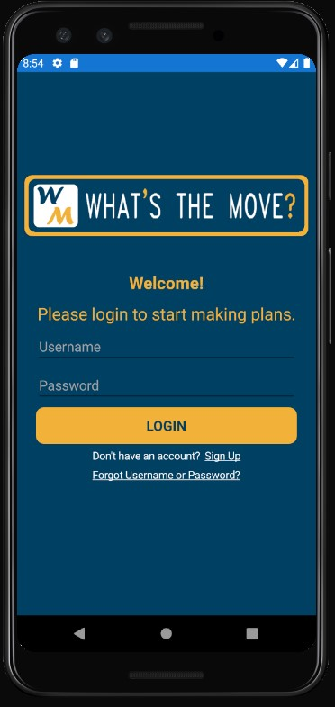

 
<h1 style="text-align: center; display: block; margin-left: auto; margin-right: auto; width: 50%"> What's The Move?</h1>

Mobile Application User Manual</h4>

###### Introduction
“What’s The Move?” is a mobile application that provides a way for users to easily find activities to do in their free time. No longer will users have to perform a web search of, “Fun things to do near me”. “What’s The Move?” leads the user to fun. Each user will be able to: 
 - Setup a personal user profile
 - Set and edit activity preferences
 - Save a set of activity preferences
 - Use activity preferences to search for activities
 - See and re-use past searches 
 - View specific details of activities
 - Navigate to websites of businesses promoting activities
 - Rate activity suggestions for relevance
 - Share activity suggestions with friends

###### Compatibility
“What’s The Move?” is a user-friendly app that is compatible with both Android and iOS devices
- Android Phones
- iPhones

###### Help
Any questions, issues, or feedback can be submitted through the application and will go to the developers behind the application. Clicking the “Help” button in the application’s main navigation menu will allow the user to send feedback to the development team. 

###### Installation
"What’s the Move?" is not currently available for install from respective app stores. If scope were added to this project, we would apply to have the app added to the Google Play store and Apple App Store.
- This repository can be cloned and the app can be run in an emulator, or can be debugged on a physical device

###### Logging In - Creating an Account
Follow these instructions to create an account. 
 1. Open the app
 2. Under the login button, tap “Sign up”
 3. A page will open with different Preferences:  
 &nbsp;&nbsp;&nbsp;&nbsp;&nbsp;&#9900; First Name and Last Name  
 &nbsp;&nbsp;&nbsp;&nbsp;&nbsp;&#9900; Date of Birth  
 &nbsp;&nbsp;&nbsp;&nbsp;&nbsp;&#9900; Default Zip Code  
 &nbsp;&nbsp;&nbsp;&nbsp;&nbsp;&#9900; Email  
 &nbsp;&nbsp;&nbsp;&nbsp;&nbsp;&#9900; Username
 &nbsp;&nbsp;&nbsp;&nbsp;&nbsp;&#9900; Password + Confirm Password
 4. Enter your information
 5. Tap create account

 
 

 
 

###### Logging In - Login
If you already have an account, follow these instructions: 
 - Open the app
 - Enter username
 - Enter user password
 - Tap Login

 
 

 
 

###### Editing User Profile Settings
“What’s The Move?” will utilize information inside a created user profile.  These settings will help decide common settings across all preferences when influencing what activities to show.  After logging in you will be asked to set these global preferences, these include but are not limited to:
 - Age (for activities with age restrictions)
 - Location
 - In general properties that are not like likely to change

To edit these options, simply click on the user profile icon.  This will bring up your profile, and pressing the “preferences” tab will show your global preferences and selecting the edit icon will allow you to edit, add, remove user preferences.

###### Setting Preferences
When asking “What’s The Move?” to give activities, you will be asked to set preferences.  This will allow the app to curate the best activities based on these preferences.  These preferences include options such as:
 - Zip Code
 - Distance (Radius) 
 - Group Size
 - Food
 - Drinks
 - Energy Level
 - Budget
 - Dress Code

All of these will help decide which activity is best for you and your group, and the flexibility of these allows you to change them at your discretion if you do not have interest in any of the suggested activities.  If you create a set of preferences that you believe will be used frequently you will have the option to save, name, and use them later.

 
 

 
 

###### Seeing Saved/Previous Preferences
Saved preferences will be stored under the "Preference History" dropdown in the Preferences view.  This will allow you to go through and see all the preferences you decided to keep.  You can then go in and edit these as you choose; however, these changes are final and multiple versions are not saved, so change at your own discretion.  You can also add a new preference set by selecting the “add preference set” button.  To use these saved preferences when looking for activities, simply select “use saved preference” and choose the desired one instead of filling out preferences when asking “what’s the move” to give activities.

###### Home Interaction
The Home screen will be the users starting point once they have used the app and set up their user profile. The home screen will include:
 - “What’s The Move?” button to direct user to Preferences page
 - “My Favorite Moves" button to direct user to activities they have favorited in the past

 
 

 
 

###### Performing a Search
On the home page, there will be a button to ask the question: “What’s the move?”. The user will be redirected to the Preferences page. This page will allow the user to set a new set of preferences, or use an old set of preferences to perform the activity search.

Once the user has set their preferences, there will be a button for the user to click to “Search” for activities to do that fit the preferences set by the user. Upon clicking this button, the user will be taken to a new page with a list of results. These results will be ranked based on how relevant the result is to the preferences taken as input, with the most compelling and relevant results listed at the top of the page. Each result will have information such as location, operating hours, pictures, reviews, link to establishment website, and other information to further help the user decide if this activity is right for them.

###### Interacting With Results
The user will have the ability to scroll through the list of activities the application has returned. If the user is dissatisfied with the results, they will have the ability to “Return to Preferences” to alter, say, how far they are willing to drive. 

Once the user has found a satisfactory activity, they can select the option by clicking on it. A prompt will appear asking the user: “Is this the move?” where they have the option to select Yes or No. Selecting “Yes” tells “What’s the Move” that the user has made a decision, and the application will save the choice to the “Previous Activities” section located on the home screen. Then the user will be redirected to the home screen. The user can favorite and activity by swiping to the left on the specific activity.

###### Frequenty Asked Questions (FAQ)
**Q**: Does it cost anything to use *What's the Move?*   
**A**: No, our application is completely free. No exceptions.  

**Q**: How can I be sure that my profile information is safe?   
**A**: We have taken several measures to ensure your information is secure. For one, we do not ask for any personally identifiable information. Secondly, we are securely hashing passwords. We are doing this so well, that we do not even know your passwords! Finally, our database is secure, and can only be accessed by our own servers. 

**Q**: How can I edit profile information that I cannot edit within the application?   
**A**: Reach out to us directly with your request, and we can work with you to update your information. 

**Q**: What if I am not enjoying the app?   
**A**: Please reach out to us, we would love your feedback!

**Q**: What is the point of *What's the Move?*   
**A**: To equip you with ideas of how to have fun and enjoy time with others!  

